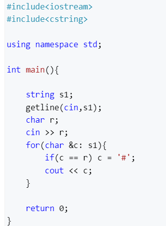

# My-SimpleAlgorithm
一些简单的算法代码文件
# 简单算法

My-SimpleAlgorithm/MyJavaCoide/src/java/algorithm/WriteMapTest.java 这是一个二维矩阵循环输出的算法

***

My-SimpleAlgorithm/MyJavaCoide/src/java_/algorithm/StringCount/StringCountMain 这是一个求字符串中重复最多的字符

